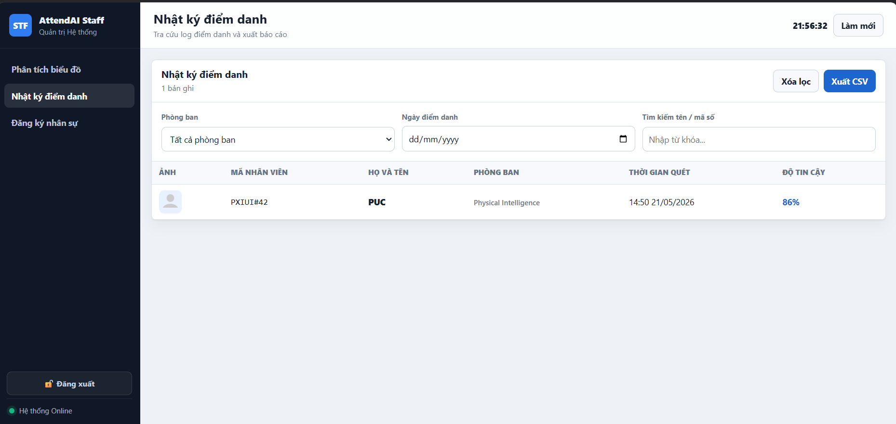
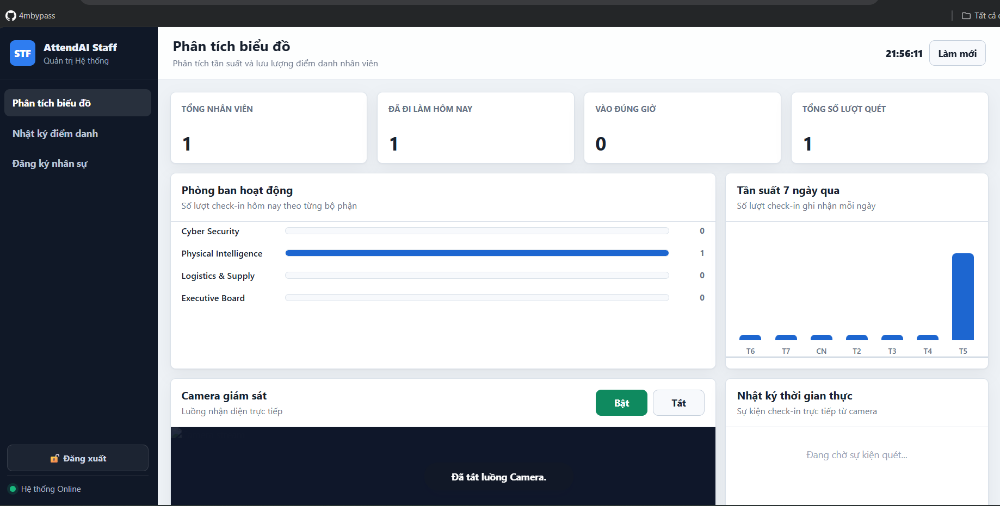
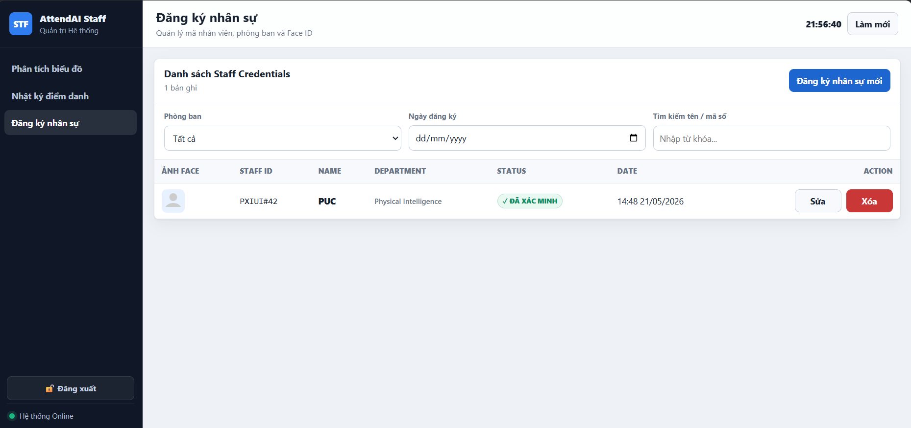
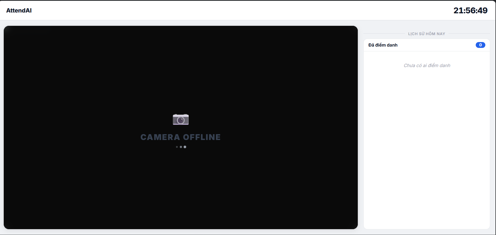

# AttendAI - Hệ Thống Điểm Danh Khuôn Mặt (Face Attendance System)

Hệ thống nhận diện khuôn mặt tự động, siêu nhanh và nhẹ gọn dành cho quản lý nhân sự/sinh viên. Áp dụng công nghệ Zero-shot Face Recognition với InsightFace, không yêu cầu train lại model khi thêm người mới.

<div align="center">
  
  
</div>

## ✨ Tính Năng Nổi Bật

* **Nhận Diện Realtime (Kiosk):** Xử lý mượt mà luồng camera thời gian thực qua WebSocket, vẽ bounding box siêu nhẹ trực tiếp trên trình duyệt.
* **Zero-shot Enrollment:** Đăng ký nhân sự chỉ cần một tấm ảnh tĩnh duy nhất (Face Embedding), nhận diện ngay lập tức mà không phải huấn luyện (train) lại AI.
* **Giao Diện Quản Trị Premium:** Dashboard cực kỳ chuyên nghiệp với biểu đồ thống kê, Responsive 100% cực nét trên màn hình Mobile.
* **Quản Lý & Phân Tích Thông Minh:** Tích hợp bộ lọc thời gian (Ngày), bộ lọc phòng ban, tìm kiếm văn bản trực tiếp.
* **Chống SPAM Điểm Danh:** Kiểm soát thời gian chống điểm danh lặp lại, có fallback hiện ảnh đã đăng ký khi không chụp được ảnh snapshot. Popup thông báo sử dụng thư viện SweetAlert2 hiện đại.

<div align="center">
  
  
</div>

## 🚀 Cài Đặt và Khởi Chạy

```bash
# 1. Tải source code và cài môi trường
git clone https://github.com/Phuc710/AttendAI.git
cd AttendAI

python -m venv venv
# Kích hoạt môi trường (Windows)
venv\Scripts\activate

# Cài đặt thư viện
pip install -r requirements.txt

# 2. Cấu hình Camera và Hệ thống
cp .env.example .env
# (Lưu ý: Mở file .env và chỉnh CAMERA_SOURCE=0 nếu dùng camera laptop)

# 3. Chạy Server
cd backend
python main.py
```

## 🌐 Các Đường Dẫn Truy Cập

| Màn hình | URL truy cập | Mô tả |
| :--- | :--- | :--- |
| **Kiosk** | `http://localhost:8000/kiosk` | Giao diện toàn màn hình đặt trước cửa ra vào, có bật stream luồng Camera điểm danh. |
| **Admin** | `http://localhost:8000/admin` | Trang quản trị viên (Quản lý User, Log điểm danh, Dashboard biểu đồ). |
| **API Docs** | `http://localhost:8000/docs` | Tài liệu API (Swagger UI). |

## 🛠 Công Nghệ Sử Dụng (Tech Stack)

* **Backend:** Python, FastAPI, SQLite (cơ sở dữ liệu), InsightFace (lõi AI).
* **Frontend:** HTML5, CSS thuần túy (Thiết kế System Design riêng cực đẹp), JS thuần túy, Chart.js, SweetAlert2.
* **Truyền dẫn:** HTTP/RESTful cho CRUD, và **WebSocket** cho truyền tải khung hình (Video Stream) với độ trễ thấp.
